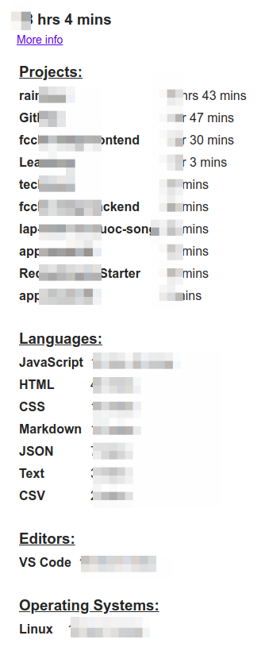
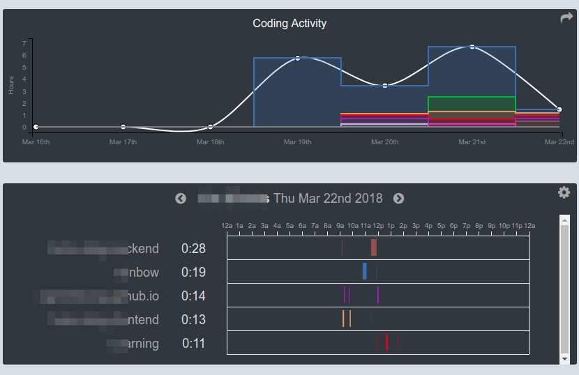
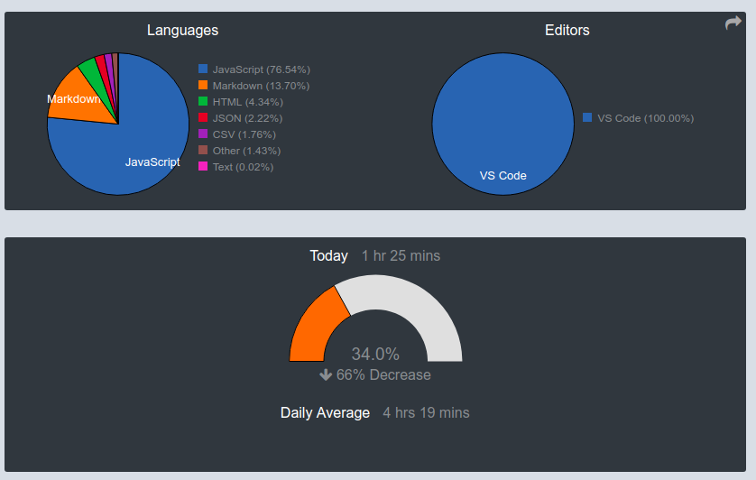

# Phác thảo về Wakatime Personal Builder 

## Về Wakatime

- Wakatime là công cụ tích hợp vào editor, ghi nhận thời gian mà người dùng sử dụng editor đó để làm việc trên các dự án và ngôn ngữ lập trình, cuối cùng tổng hợp lại theo tuần, tháng, năm để người dùng hình dung được tổng thể quá trình làm việc của mình. 
- Xem về Wakatime tại đây: [https://Wakatime.com](https://Wakatime.com)
- Ảnh minh họa:

## Tại sao lại có Wakatime Personal Builder

- Wakatime cho sử dụng free, nhưng chỉ nhận được kết quả theo tuần (qua email), và dashboard cũng chỉ có kết quả của 01 tuần gần nhất. Muốn theo dõi và tổng hợp cho quá trình dài hơn 1 tuần, người dùng:
    - hoặc tự ghi chép kết quả từ Email vào file Excel
    - hoặc đóng tiền để sử dụng gói cao cấp hơn 

- Wakatime Personal Builder (gọi tắt là WtPB) có mục đích giúp người dùng tự động lưu lại kết quả hàng tuần, rồi tổng hợp để đưa ra kết quả tương tự như gói cao cấp trả tiền của Wakatime. 

## Tính năng của Wakatime Personal Builder

- Cho phép 1 người dùng. Việc nhiều người dùng sẽ nằm trong giai đoạn 2. 
- Hiển thị dữ liệu các biểu đồ giống như Wakatime Dashboard
- Hiển thị dữ liệu dạng bảng (danh sách) giống như Wakatime Dashboard

## Nguyên lý của Wakatime Personal Builder

WtPB sẽ gọi API (miễn phí) của Wakatime mỗi tuần 1 lân vào 1 thời điểm nhất định, nhận lại kết quả của 01 tuần gần nhất, sau đó tổng hợp vào cơ sở dữ liệu để giúp xây dựng kết quả của toàn bộ quãng thời gian kể từ khi bắt đầu sử dụng WtPB. 

Do giới hạn của Wakatime, WtPB không có khả năng lấy dữ liệu của thời điểm trước khi người dùng sử dụng WtPB.  

## Các thành phần của Wakatime Personal Builder

Công nghệ dự kiến sử dụng:
- Node.js
- Express.js
- MongoDB (và Mongoose)
- React

### A. Back-end:

Có 2 tính năng cơ bản

1. **Lấy dữ liệu**: 
    - Hoạt động theo lịch, đến giờ hẹn trước sẽ tự động truy cập vào Wakatime API để lấy dữ liệu JSON cho 01 tuần gần nhất.
    - Lưu dữ liệu vào database theo cấu trúc định sẵn.

2. **Trả dữ liệu**: Tương tự như 1 Restfull API:
    - Khi API được gọi, nó sẽ trả về 1 file JSON là tổng hợp dữ liệu của toàn bộ quãng thời gian thu thập.

### B. Front-end:

Giai đoạn 1: Chỉ sử dụng cho 1 cá nhân.

- Nhập username
- Nhập API key
- Hiển thị các chart và dữ liệu giống như Wakatime Dashboard.

Giai đoạn 2: Nhiều người có thể đăng ký. Mỗi người sau khi đăng nhập bằng username và pasword có thể xem riêng trang của họ. 

## Tham khảo:

- Mẫu API: "https://Wakatime.com/api/v1/users/current/stats/last_7_days?api_key="